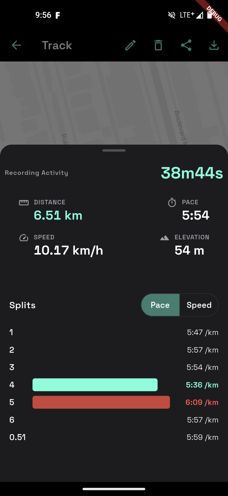
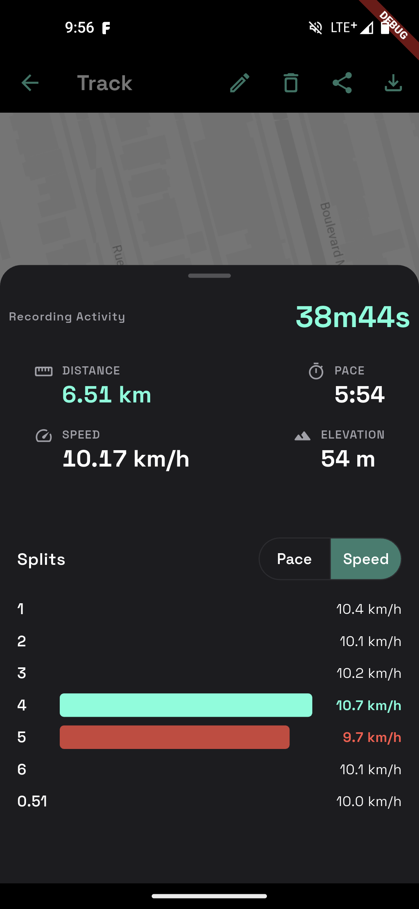

# furtive

Privacy first. No accounts. No Google services. Full access to your GPS sensor.

## Install

[Download the latest apk](https://github.com/ethicnology/furtive/releases/latest)

The Obtainium button opens on a device with [Obtainium](https://github.com/ImranR98/Obtainium) installed. Otherwise, add it manually: paste `https://github.com/ethicnology/furtive` as a GitHub source in Obtainium.

## Screenshots

<table>
<tr>
<td></td>
<td></td>
</tr>
<tr>
<td></td>
<td></td>
</tr>
<tr>
<td></td>
<td></td>
</tr>
</table>

## Build-time flags

- `PROTOMAPS_KEY` / `PROTOMAPS_URL` — map tiles, see "Reproducible builds"
  below.
- `DISABLE_UPDATE_CHECK=true` — disables the opt-out GitHub release check
  entirely at compile time (no code path, no network call ever made),
  independent of the in-app preference. Off by default. Intended for
  distribution channels that already manage updates themselves (e.g.
  F-Droid), where an app also phoning GitHub — even opt-out — is typically
  flagged as an anti-feature.

## GPS signal loss

GPS stops working indoors (store, tunnel, deep urban canyon) while a
recording stays active. Furtive detects these outages from the fix cadence:
when the time since the last fix exceeds ~10× the recent median interval
(clamped to 30 s – 6 min), the gap is bracketed as a **signal lost** span —

- elapsed time is never rewritten; active duration, distance and pace
  simply exclude the outage,
- the map draws a dashed line across the unknown stretch instead of a
  solid straight line through buildings,
- the outage duration is reported on the activity detail screen,
- GPX files represent the gap as separate `<trkseg>` blocks (the GPX 1.1
  semantics for lost reception), both on export and import.

The path travelled during an outage is unknowable after the fact — for long
indoor breaks, pausing the recording manually remains the most accurate
option.

## Releases

Release artifacts are produced unsigned by Flutter (`signingConfig = null`
in `android/app/build.gradle.kts`) and signed out-of-band with
`apksigner` / `zipalign`. Keystores never enter this repository — do
not add a `key.properties` or wire signing into Gradle.

## Reproducible builds

`make apk` produces byte-identical output for the same source on any
host. The toolchain is pinned end-to-end:

- `debian:trixie@sha256:…` (multi-arch index digest, in `Containerfile.tools`)
- Flutter `3.44.6` via `.fvmrc`
- Android NDK / SDK / build-tools / JVM in `android/gradle.properties`
- `pubspec.lock` enforced via `flutter pub get --enforce-lockfile`
- `SOURCE_DATE_EPOCH = $(git log -1 --format=%ct)` passed to the container
  so Gradle/AGP/Kotlin emit deterministic timestamps

Verify locally with `make verify-reproducible` (builds twice, compares
SHA-256, fails with a diffoscope hint on mismatch).

Empty/missing `PROTOMAPS_KEY` produces the FOSS path (no map tiles, but
otherwise functional) — that's the variant anyone in the world can
rebuild and verify bit-for-bit. The keyed variant is reproducible by
anyone holding the same key. Mobile API keys are not secret in any
case: anyone can extract one from a shipped APK via `strings`.
